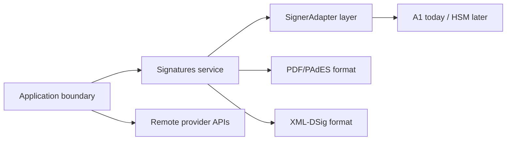

**What you'll do:** learn the one split that keeps the codebase predictable: signers own signing power, formats own document mutation, apps own runtime boundaries.

SignatureKit is not an A1 wrapper with PDF helpers bolted on. It is a set of Effect services and format packages around one capability: `Signatures`.

## The model in prose

Application code provides a signer layer. The `Signatures` service exposes `inspect`, `certificate`, `importSigningKey`, `sign`, and `verify`. Format packages consume that service when they need cryptographic bytes, then mutate their own document format. Remote providers do not enter this graph; they create upstream ceremonies through HTTP resources.



## Why this matters

- Swapping A1 for another local signer changes the layer, not `signPdf` or `signXml`.
- Browser UI can own interaction while `@signature-kit/pdf` owns byte parsing, placement, stamping, and signing workflow.
- Provider APIs remain honest: Clicksign, Assinafy, ZapSign, DocuSeal, and Documenso own external ceremonies instead of pretending to be local signers.
- Typed errors stay in the Effect error channel until your app decides how to render them.

```ts title="same-boundary.ts"
const layer = a1SignaturesLayer({ pfx, password })

const signedPdf = signPdf({ pdf, policy: "pades-icp-brasil" }).pipe(Effect.provide(layer))
const signedXml = signXml({ xml, referenceId: "nfe-1" }).pipe(
  Effect.provide(layer),
  Effect.provide(xmlRuntimeLayer),
)
```

## Go deeper

<Cards>
  <Card title="Legal validity" href="/docs/concepts/legal-validity">How ICP-Brasil, A1/A3, and PAdES policy fit the Brazilian legal context.</Card>
  <Card title="Signer boundary" href="/docs/concepts/signer-boundary">Where signing power enters the system.</Card>
  <Card title="Effect runtime" href="/docs/concepts/effect-runtime">Why public APIs return typed Effect values.</Card>
  <Card title="Document formats" href="/docs/concepts/document-formats">Why PDF and XML mutate documents, not signers.</Card>
  <Card title="Browser PDF flow" href="/docs/signing/browser-pdf-flow">Where React ends and Effect signing begins.</Card>
  <Card title="Remote requests" href="/docs/concepts/remote-signature-requests">How provider requests differ from local Signatures.</Card>
</Cards>
