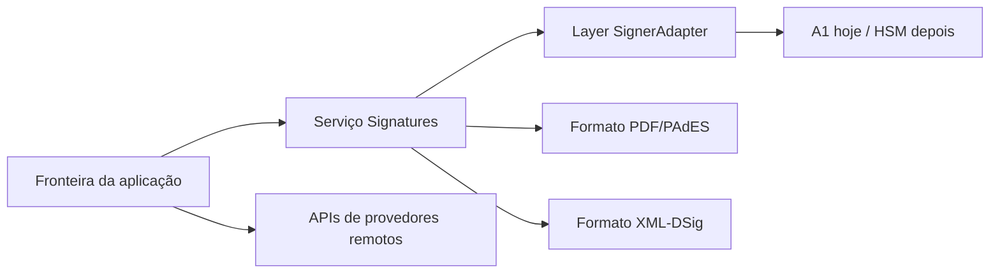

**O que você vai fazer:** entender a separação que mantém o código previsível: signers possuem o poder de assinatura, formatos possuem a mutação de documento e apps possuem as fronteiras de runtime.

SignatureKit não é um wrapper de A1 com helpers de PDF acoplados. É um conjunto de serviços Effect e pacotes de formato ao redor de uma capability: `Signatures`.

## O modelo em prosa

O código da aplicação fornece uma layer de signer. O serviço `Signatures` expõe `inspect`, `certificate`, `importSigningKey`, `sign` e `verify`. Pacotes de formato consomem esse serviço quando precisam de bytes criptográficos e então mutam o próprio formato de documento. Provedores remotos não entram nesse grafo; eles criam cerimônias upstream por recursos HTTP.



## Por que isso importa

- Trocar A1 por outro signatário local muda a layer, não `signPdf` nem `signXml`.
- A UI de navegador pode possuir a interação enquanto `@signature-kit/pdf` possui parsing de bytes, posicionamento, carimbo e workflow de assinatura.
- APIs de provedores continuam honestas: Clicksign, Assinafy, ZapSign, DocuSeal e Documenso possuem cerimônias externas em vez de fingir que são signers locais.
- Erros tipados ficam no canal de erro do Effect até sua app decidir como renderizá-los.

```ts title="mesma-fronteira.ts"
const layer = a1SignaturesLayer({ pfx, password })

const signedPdf = signPdf({ pdf, policy: "pades-icp-brasil" }).pipe(Effect.provide(layer))
const signedXml = signXml({ xml, referenceId: "nfe-1" }).pipe(
  Effect.provide(layer),
  Effect.provide(xmlRuntimeLayer),
)
```

## Aprofunde

<Cards>
  <Card title="Validade jurídica" href="/docs/concepts/legal-validity">Como ICP-Brasil, A1/A3 e política PAdES entram no contexto jurídico brasileiro.</Card>
  <Card title="Fronteira do signer" href="/docs/concepts/signer-boundary">Onde o poder de assinatura entra no sistema.</Card>
  <Card title="Runtime Effect" href="/docs/concepts/effect-runtime">Por que APIs públicas retornam Effects tipados.</Card>
  <Card title="Formatos de documento" href="/docs/concepts/document-formats">Por que PDF e XML mutam documentos, não signers.</Card>
  <Card title="Fluxo PDF no navegador" href="/docs/signing/browser-pdf-flow">Onde React termina e a assinatura Effect começa.</Card>
  <Card title="Requests remotos" href="/docs/concepts/remote-signature-requests">Como requests de provedores diferem de Signatures locais.</Card>
</Cards>
