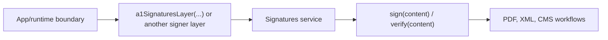

**What you'll do:** separate the key-custody concern from PDF/XML document work, then wire a signer through the `Signatures` service instead of hiding it in format code.

The `SignerAdapter` is the capability seam. It can inspect a certificate, expose the certificate, import a signing key, sign bytes, and verify bytes. It does not know whether the caller is building XML-DSig, PAdES, CMS, or a UI preview.

That split keeps A1 as one backend, not the product definition. A future HSM signer can satisfy the same capability without moving PDF or XML code.

## Rule

- Signers answer **where the key comes from**.
- Format packages answer **how the document is changed**.
- Application boundaries provide the concrete signer layer.

## Diagram in prose

Read left to right: the app chooses a concrete layer, the service exposes a stable capability, and formats consume the capability without learning where the private key lives.



## Minimal seam

```ts title="signer-seam.ts"
import { a1SignaturesLayer } from "@signature-kit/a1/signer"
import { signatures } from "@signature-kit/signatures"
import { Effect, Redacted } from "effect"

const program = Effect.gen(function* () {
  const identity = yield* signatures.inspect()
  const artifact = yield* signatures.sign({ content, algorithm: "rsa-sha256" })

  return { identity, artifact }
}).pipe(
  Effect.provide(
    a1SignaturesLayer({
      pfx,
      password: Redacted.make(password),
    }),
  ),
)
```

No format package is present in that program. When `signPdf` or `signXml` needs a signature, it asks the same service for bytes.

<Cards>
  <Card title="The signing boundary" href="/docs/signing/signers">Read the API-level SignerAdapter page.</Card>
  <Card title="PDF signing" href="/docs/signing/pdf">See how the PDF format consumes Signatures.</Card>
  <Card title="Browser PDF flow" href="/docs/signing/browser-pdf-flow">See where UI state ends and the signer layer begins.</Card>
</Cards>
