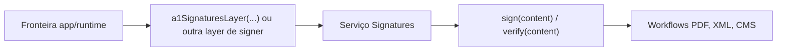

**O que você vai fazer:** separar a guarda da chave do trabalho de documento PDF/XML e então conectar um signer pelo serviço `Signatures` em vez de escondê-lo dentro do formato.

O `SignerAdapter` é a fronteira de capability. Ele inspeciona certificado, expõe certificado, importa chave, assina bytes e verifica bytes. Ele não sabe se o chamador está montando XML-DSig, PAdES, CMS ou preview de UI.

Essa separação mantém A1 como um backend, não como definição do produto. Um HSM futuro pode satisfazer a mesma capability sem mover código de PDF ou XML.

## Regra

- Signers respondem **de onde vem a chave**.
- Pacotes de formato respondem **como o documento muda**.
- A borda da aplicação fornece a layer concreta do signer.

## Diagrama em prosa

Leia da esquerda para a direita: a app escolhe uma layer concreta, o serviço expõe uma capability estável e os formatos consomem essa capability sem aprender onde a chave privada vive.



## Fronteira mínima

```ts title="fronteira-signer.ts"
import { a1SignaturesLayer } from "@signature-kit/a1/signer"
import { signatures } from "@signature-kit/signatures"
import { Effect, Redacted } from "effect"

const program = Effect.gen(function* () {
  const identity = yield* signatures.inspect()
  const artifact = yield* signatures.sign({ content, algorithm: "rsa-sha256" })

  return { identity, artifact }
}).pipe(
  Effect.provide(
    a1SignaturesLayer({
      pfx,
      password: Redacted.make(password),
    }),
  ),
)
```

Nenhum pacote de formato aparece nesse programa. Quando `signPdf` ou `signXml` precisa de uma assinatura, ele pede bytes ao mesmo serviço.

<Cards>
  <Card title="A fronteira de assinatura" href="/docs/signing/signers">Leia a página de API do SignerAdapter.</Card>
  <Card title="Assinatura PDF" href="/docs/signing/pdf">Veja como o formato PDF consome Signatures.</Card>
  <Card title="Fluxo PDF no navegador" href="/docs/signing/browser-pdf-flow">Veja onde o estado de UI termina e a layer de signer começa.</Card>
</Cards>
