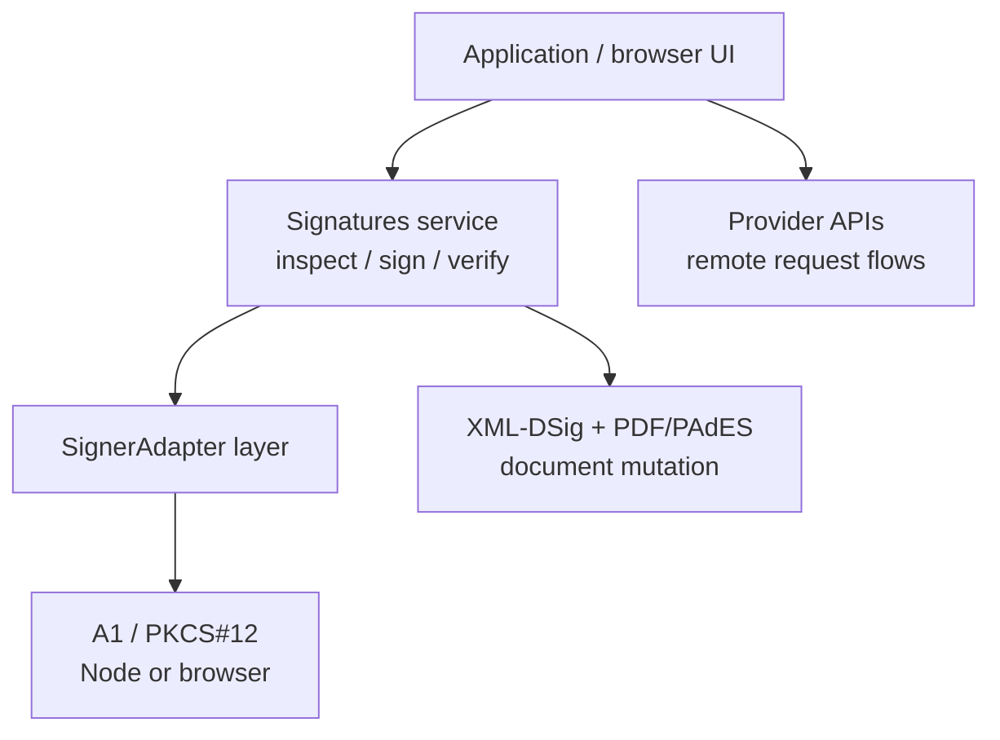

SignatureKit has one signing boundary: the `Signatures` Effect service. Start with an A1 / PKCS#12 certificate, then reuse the same boundary from Node, the browser, XML-DSig, and PDF/PAdES. Remote providers stay separate provider APIs; browser UI stays at the application edge.

## Choose the path

<Cards>
  <Card title="Install A1" href="/docs/get-started/installation" description="Add the Effect runtime, the core Signatures service, and the PKCS#12 signer." />
  <Card title="First signature" href="/docs/get-started/quickstart" description="Load an A1 certificate, inspect the identity, sign bytes, and verify the result." />
  <Card title="PDF/PAdES" href="/docs/signing/pdf" description="Sign PDFs by placing a detached CMS signature into a PDF placeholder." />
  <Card title="Browser PDF flow" href="/docs/a1-signing/browser-pdf-flow" description="Read PDF bytes, render placement UI, and provide the A1 layer only at the action boundary." />
</Cards>

## One boundary



```ts title="signature-kit.ts"
import { a1SignaturesLayer } from "@signature-kit/a1/signer"
import { signatures } from "@signature-kit/core/signatures"
import { Effect, Redacted } from "effect"

export const signWithA1 = (content: Uint8Array, pfx: Uint8Array, password: string) =>
  Effect.gen(function* () {
    const identity = yield* signatures.inspect()
    const artifact = yield* signatures.sign({ content, algorithm: "rsa-sha256" })

    return { identity, artifact }
  }).pipe(
    Effect.provide(
      a1SignaturesLayer({
        pfx,
        password: Redacted.make(password),
      }),
    ),
  )
```

The program knows the contract, not the key location. Browser A1, server A1, XML, and PDF/PAdES all provide or consume the same service.

## Product rules

- **A1 first.** The first local signer is PKCS#12 (`.pfx` / `.p12`) with passwords kept in `Redacted`.
- **Browser PDF is format-owned.** `@signature-kit/pdf` owns file bytes, placement state, and browser A1 PDF signing; app UI only subscribes to that state and provides `a1SignaturesLayer` at the action boundary.
- **Formats mutate documents.** XML-DSig and PDF/PAdES own document mutation around `signatures.sign`; signer adapters only own signing power.
- **Remote APIs stay explicit.** Clicksign, Assinafy, ZapSign, DocuSeal, and Documenso keep provider-specific APIs instead of pretending to be one universal signer.
- **Failures are values.** Recoverable faults are typed `SignatureKitError` or package-specific Effect errors, not thrown exceptions.

## Go deeper

<Cards>
  <Card title="PDF/PAdES" href="/docs/signing/pdf" description="Detached CMS signing and placeholder sizing for PDF documents." />
  <Card title="XML-DSig" href="/docs/signing/xml" description="XML mutation through an explicit XmlRuntime dependency." />
  <Card title="Provider APIs" href="/docs/providers/request-shape" description="Clicksign, Assinafy, ZapSign, DocuSeal, and Documenso as explicit upstream request packages." />
  <Card title="Error catalog" href="/docs/signing/errors" description="Literal error codes and the metadata preserved at each failure point." />
</Cards>

```package-install
@signature-kit/core @signature-kit/a1
```

<Callout type="warn" title="Local checks are not legal validity">
  `verifyXml`, `verifyPdf`, and `signatures.verify` confirm the cryptography against the key in the
  document — not legal validity. Verify with your own ICP-Brasil trust chain and policy before
  treating a signed document as valid.
</Callout>
