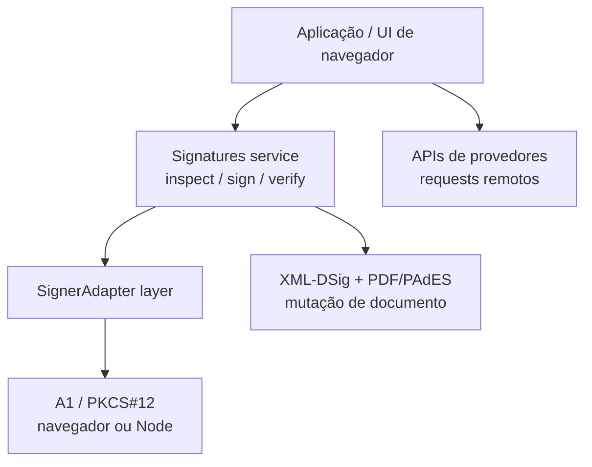

SignatureKit mantém o poder de assinatura atrás de um serviço Effect. Comece com certificado A1 / PKCS#12; reutilize a mesma fronteira no Node, no navegador, em XML-DSig e em PDF/PAdES. Provedores remotos continuam como APIs próprias, sem virar um gateway universal falso.



## Escolha o caminho

<Cards>
  <Card title="Primeira assinatura" href="/docs/get-started/quickstart" description="Carregue um A1, leia a identidade, assine bytes e verifique o resultado." />
  <Card title="Certificados A1" href="/docs/signing/certificates" description="PKCS#12, identidade e-CPF / e-CNPJ, senha e falhas comuns de certificado." />
  <Card title="Fronteira de assinatura" href="/docs/signing/signers" description="O contrato SignerAdapter e o serviço Signatures consumido por formatos e React." />
  <Card title="Fluxo PDF no navegador" href="/docs/a1-signing/browser-pdf-flow" description="PDF entra, UI posiciona a assinatura, layer A1 roda só na ação do usuário." />
</Cards>

## O contrato

```ts title="signature-kit.ts"
import { a1SignaturesLayer } from "@signature-kit/a1/signer"
import { signatures } from "@signature-kit/core/signatures"
import { Effect, Redacted } from "effect"

export const program = Effect.gen(function* () {
  const identity = yield* signatures.inspect()
  const artifact = yield* signatures.sign({ content, algorithm: "rsa-sha256" })

  return { identity, artifact }
}).pipe(
  Effect.provide(
    a1SignaturesLayer({
      pfx,
      password: Redacted.make("certificate-password"),
    }),
  ),
)
```

Esse programa não sabe onde a chave vive. A1 no navegador, A1 no servidor e módulos de formato fornecem ou consomem o mesmo serviço `Signatures`.

## O que importa

- **A1 primeiro.** O signer local principal é PKCS#12 (`.pfx` / `.p12`) com segredo em `Redacted`.
- **PDF no navegador pertence ao formato.** `@signature-kit/pdf` cuida de bytes, estado de posicionamento e assinatura PDF A1 no navegador; a UI da app só assina esse estado e fornece `a1SignaturesLayer` na fronteira da ação.
- **Formatos fazem o trabalho de documento.** XML-DSig e PDF/PAdES mutam documentos ao redor de `signatures.sign`; adapters de signer não cuidam de XML ou layout de PDF.
- **Falhas são valores.** Erros recuperáveis são `SignatureKitError` tipados no canal de erro do Effect, não exceções lançadas.

## Aprofunde

<Cards>
  <Card title="PDF/PAdES" href="/docs/signing/pdf" description="CMS detached e tamanho de placeholder para documentos PDF." />
  <Card title="XML-DSig" href="/docs/signing/xml" description="Mutação de XML com dependência explícita de XmlRuntime." />
  <Card title="APIs de provedores" href="/docs/providers/request-shape" description="Clicksign, Assinafy, ZapSign, DocuSeal e Documenso como pacotes upstream explícitos." />
  <Card title="Catálogo de erros" href="/docs/signing/errors" description="Códigos literais e metadados preservados em cada ponto de falha." />
</Cards>

```package-install
@signature-kit/core @signature-kit/a1
```

<Callout type="warn" title="Verificações locais não são validade jurídica">
  `verifyXml`, `verifyPdf` e `signatures.verify` confirmam a criptografia contra a chave presente no
  documento — não a validade jurídica. Verifique com sua própria cadeia de confiança e política ICP-Brasil antes de
  tratar um documento assinado como válido.
</Callout>
