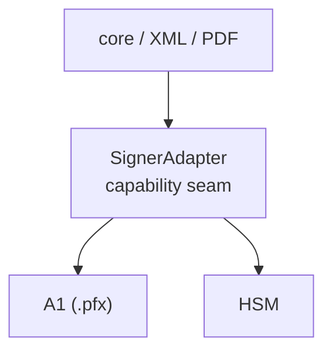

**The core idea:** the `SignerAdapter` is the seam where local signing power enters. It answers _where_ bytes are signed — an A1 `.pfx` or HSM — while document formats (core, XML, PDF) talk to one fixed shape. Provider APIs own upstream remote ceremonies separately.



## The SignerAdapter contract

The type below is the literal definition from `@signature-kit/core/config`. Its doc-comment pins the rule this page details: the signer owns where signing power comes from, and **never** owns format mutation.

```ts title="core/core/src/config.ts"
/**
 * The capability seam. A signer owns "where the signing power comes from".
 * It never owns document-format mutation (XML/PDF live in format modules).
 */
export type SignerAdapter = {
  readonly id: string;
  inspect(): Effect.Effect<SignerIdentity, SignatureKitError>;
  certificate(): Effect.Effect<Certificate, SignatureKitError>;
  importSigningKey(algorithm: SignatureAlgorithm): Effect.Effect<CryptoKey, SignatureKitError>;
  sign(input: SignInput): Effect.Effect<SignatureArtifact, SignatureKitError>;
  verify(input: VerifyInput): Effect.Effect<VerificationResult, SignatureKitError>;
};
```

## The six members of the seam

Every `SignerAdapter` implementation delivers exactly these six members:

- `id: string` — identity of the signing backend. A1 uses `"a1"`. Provider APIs such as Clicksign, Assinafy, ZapSign, DocuSeal, and Documenso use `create*SignatureRequest(...)` functions and do not go through this XML/PDF mutation seam.
- `inspect()` — returns `Effect<SignerIdentity, SignatureKitError>` with `subject`, `issuer`, `serialNumber`, `thumbprint`, `validFrom`, `validTo` and `document?` (CPF/CNPJ when ICP-Brasil).
- `certificate()` — returns `Effect<Certificate, SignatureKitError>`, the full certificate (`certPem`, `certificateDer`, `publicKeyDer` and the `privateKeyPem: Redacted<string>`).
- `importSigningKey(algorithm)` — materializes the signing `CryptoKey` for the requested `SignatureAlgorithm` (`"rsa-sha256"` or `"rsa-sha512"`).
- `sign(input)` — takes `SignInput` (`{ content, algorithm }`) and returns a `SignatureArtifact` (`{ algorithm, signature }`).
- `verify(input)` — takes `VerifyInput` (`{ content, signature, algorithm }`) and returns `VerificationResult`, whose field is `valid: boolean`.

<Callout type="info">
  Every member fails through the typed `SignatureKitError` error channel — never through a loose exception. The `retryable`
  flag is decided per call, not fixed by code.
</Callout>

## Building an A1

The `@signature-kit/a1` package implements the seam from a `.pfx`/`.p12` file. `loadA1SignerAdapter(options)` parses it asynchronously and returns a ready `SignerAdapter` with `id` `"a1"`.

```package-install
@signature-kit/core @signature-kit/a1
```

```ts title="signer-a1.ts"
import { loadA1SignerAdapter } from "@signature-kit/a1/signer"
import { Effect, Redacted } from "effect"

// loadA1SignerAdapter -> Effect<SignerAdapter, SignatureKitError>
const signer = yield* loadA1SignerAdapter({
  pfx,                                   // Uint8Array — PKCS#12 bytes (start at 0x30)
  password: Redacted.make(process.env.A1_PASSWORD ?? ""),
})

signer.id          // "a1"
const identity = yield* signer.inspect()   // SignerIdentity (e-CPF / e-CNPJ)
const artifact = yield* signer.sign({ content, algorithm: "rsa-sha256" })
```

<Callout type="warn">
  `A1SignerOptions` has exactly two keys — `pfx: Uint8Array` and `password: Redacted.Redacted<string>`. The bytes
  must be raw PKCS#12 (start at `0x30`); an empty buffer is rejected.
</Callout>

## Providing it as a service

The core defines `Signatures` as a `Context.Service` with tag `"@signature-kit/core/Signatures"`. You never implement it by hand: pass a `SignerAdapter` to `signaturesLayer(signer)` and get a `Layer<Signatures>` back (via `Layer.succeed`). The accessors `signatures.{inspect, certificate, importSigningKey, sign, verify}` declare the dependency on `Signatures`; the layer satisfies it.

```ts title="provide.ts"
import { signaturesLayer, signatures } from "@signature-kit/core/signatures"
import { loadA1SignerAdapter } from "@signature-kit/a1/signer"
import { Effect, Redacted } from "effect"

const program = Effect.gen(function* () {
  // Signatures accessors — they require the service, they don't know the backend.
  const identity = yield* signatures.inspect()
  const artifact = yield* signatures.sign({ content, algorithm: "rsa-sha256" })
  const result = yield* signatures.verify({
    content,
    signature: artifact.signature,
    algorithm: artifact.algorithm,
  })
  return result.valid
})

const signer = yield* loadA1SignerAdapter({ pfx, password: Redacted.make(pwd) })

// signaturesLayer(signer) -> Layer<Signatures>  (Layer.succeed)
yield* program.pipe(Effect.provide(signaturesLayer(signer)))
```

## Automatic provider for formats

For formats, A1 offers a shortcut: `a1SignaturesLayer(options)` returns a `Layer<Signatures, SignatureKitError>` directly, with no adapter to instantiate first. `signXml` and `signPdf` require `Signatures` in their requirements channel; hand over that layer via `Effect.provide`.

```package-install
@signature-kit/xml @signature-kit/pdf
```

```ts title="formats.ts"
import { signXml } from "@signature-kit/xml/sign"
import { xmlRuntimeLayer } from "@signature-kit/xml/engine"
import { signPdf } from "@signature-kit/pdf/sign"
import { a1SignaturesLayer } from "@signature-kit/a1/signer"
import { Effect, Redacted } from "effect"

// a1SignaturesLayer(options) -> Layer<Signatures, SignatureKitError>
const layer = a1SignaturesLayer({ pfx, password: Redacted.make(pwd) })

// The formats require Signatures; the layer is the only thing that changes per backend.
const signedXml = yield* signXml({ xml, referenceId: "nfe-1" })
  .pipe(Effect.provide(layer), Effect.provide(xmlRuntimeLayer))

const signedPdf = yield* signPdf({ pdf, policy: "pades-icp-brasil" })
  .pipe(Effect.provide(layer))
```

<Callout type="info">
  `verifyXml` and `verifyPdf` do _not_ require `Signatures` — verification doesn't need the seam, because the public key comes
  from the document itself.
</Callout>

## Swapping the backend

Because the seam is a fixed-shape port, swapping where signing power comes from means swapping the argument of `signaturesLayer(...)`. The signing work is identical; nothing about the format changes.

```ts title="swap-backend.ts"
import { signPdf } from "@signature-kit/pdf/sign"
import { signaturesLayer } from "@signature-kit/core/signatures"
import type { SignerAdapter } from "@signature-kit/core/config"
import { Effect } from "effect"

// The seam is just a port: any SignerAdapter works, as long as it has an id.
declare const a1Signer: SignerAdapter   // from loadA1SignerAdapter (id "a1")
declare const hsmSigner: SignerAdapter  // another backend that satisfies the contract

const job = signPdf({ pdf, policy: "pades-ades" })

// Same job, two backends — nothing about the PDF changes.
const withA1 = yield* job.pipe(Effect.provide(signaturesLayer(a1Signer)))
const withHsm = yield* job.pipe(Effect.provide(signaturesLayer(hsmSigner)))
```

<Callout type="info">
  Any value that satisfies `SignerAdapter` works. Here the A1 comes from `loadA1SignerAdapter`; another backend just needs to
  deliver the same six members and an `id`.
</Callout>

## Where the seam ends

The doc-comment's rule is deliberate: the `SignerAdapter` owns **where** signing power comes from, and **never** document mutation. It operates over `content: Uint8Array` and returns a `signature: Uint8Array` — opaque bytes. Embedding a signature into an enveloped XML or a PAdES PDF is the job of the format modules (`@signature-kit/xml`, `@signature-kit/pdf`), which consume the seam through `Effect.provide` and stay backend-neutral because of it.

That cut keeps the application stable: the XML doesn't know whether the key came from a `.pfx` or an HSM, and the signer doesn't know whether its bytes are an NF-e or a PDF. Each side knows only its half of the boundary.

## Errors you might see

Every seam failure is a typed `SignatureKitError`. The most common ones when building and using the signer:

<Cards>
  <Card title="signature-kit.WRONG_PASSWORD" href="/docs/signing/errors#error-catalog">Incorrect certificate password in loadA1SignerAdapter.</Card>
  <Card title="signature-kit.NO_PRIVATE_KEY" href="/docs/signing/errors#error-catalog">The file contains no private key, so importSigningKey and sign have nothing to sign with.</Card>
  <Card title="signature-kit.UNSUPPORTED_ALGORITHM" href="/docs/signing/errors#error-catalog">Algorithm outside "rsa-sha256" / "rsa-sha512".</Card>
  <Card title="signature-kit.KEY_IMPORT_FAILED" href="/docs/signing/errors#error-catalog">The CryptoKey could not be materialized in importSigningKey.</Card>
  <Card title="signature-kit.SIGN_FAILED" href="/docs/signing/errors#error-catalog">The sign operation failed in the backend.</Card>
</Cards>
