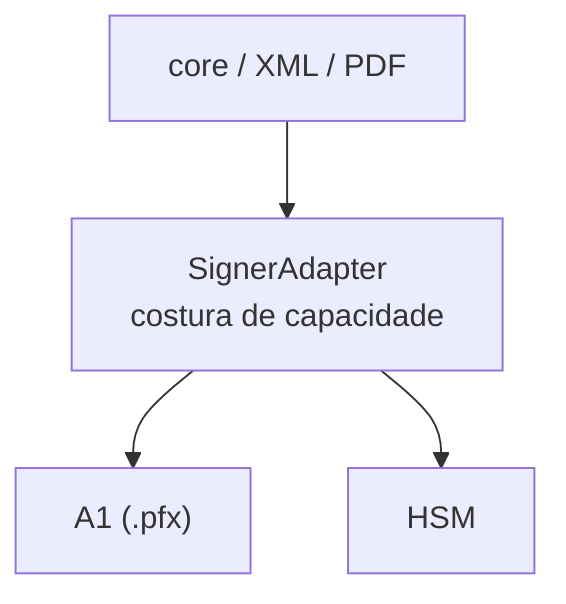

**A ideia central:** o `SignerAdapter` é a costura por onde o poder local de assinar entra. Ele responde _onde_ os bytes são assinados — um `.pfx` A1 ou HSM — enquanto os formatos de documento (core, XML, PDF) conversam com um único formato fixo. APIs de provedores possuem cerimônias remotas separadas.



## O contrato do SignerAdapter

O tipo abaixo é a definição literal exportada por `@signature-kit/core/config`. Seu doc-comment fixa a regra que esta página detalha: o `SignerAdapter` é dono de onde vem o poder de assinar e **nunca** da mutação de formato.

```ts title="core/core/src/config.ts"
/**
 * The capability seam. A signer owns "where the signing power comes from".
 * It never owns document-format mutation (XML/PDF live in format modules).
 */
export type SignerAdapter = {
  readonly id: string;
  inspect(): Effect.Effect<SignerIdentity, SignatureKitError>;
  certificate(): Effect.Effect<Certificate, SignatureKitError>;
  importSigningKey(algorithm: SignatureAlgorithm): Effect.Effect<CryptoKey, SignatureKitError>;
  sign(input: SignInput): Effect.Effect<SignatureArtifact, SignatureKitError>;
  verify(input: VerifyInput): Effect.Effect<VerificationResult, SignatureKitError>;
};
```

## Os seis membros da costura

Toda implementação de `SignerAdapter` entrega exatamente estes seis membros:

- `id: string` — identidade do backend de assinatura. O A1 usa `"a1"`. APIs de provedores como Clicksign, Assinafy, ZapSign, DocuSeal e Documenso usam funções `create*SignatureRequest(...)` e não passam por esta costura de mutação de XML/PDF.
- `inspect()` — retorna `Effect<SignerIdentity, SignatureKitError>` com `subject`, `issuer`, `serialNumber`, `thumbprint`, `validFrom`, `validTo` e `document?` (CPF/CNPJ quando ICP-Brasil).
- `certificate()` — retorna `Effect<Certificate, SignatureKitError>`, o certificado completo (`certPem`, `certificateDer`, `publicKeyDer` e a `privateKeyPem: Redacted<string>`).
- `importSigningKey(algorithm)` — materializa a `CryptoKey` de assinatura para o `SignatureAlgorithm` solicitado (`"rsa-sha256"` ou `"rsa-sha512"`).
- `sign(input)` — recebe `SignInput` (`{ content, algorithm }`) e retorna um `SignatureArtifact` (`{ algorithm, signature }`).
- `verify(input)` — recebe `VerifyInput` (`{ content, signature, algorithm }`) e retorna `VerificationResult`, cujo campo é `valid: boolean`.

<Callout type="info">
  Todo membro falha pelo canal de erro tipado `SignatureKitError` — nunca por uma exceção solta. A flag `retryable`
  é decidida por chamada, não fixada no código.
</Callout>

## Construindo um A1

O pacote `@signature-kit/a1` implementa a costura a partir de um arquivo `.pfx`/`.p12`. `loadA1SignerAdapter(options)` faz o parsing assíncrono e retorna um `SignerAdapter` pronto, com `id` `"a1"`.

```package-install
@signature-kit/core @signature-kit/a1
```

```ts title="signer-a1.ts"
import { loadA1SignerAdapter } from "@signature-kit/a1/signer"
import { Effect, Redacted } from "effect"

// loadA1SignerAdapter -> Effect<SignerAdapter, SignatureKitError>
const signer = yield* loadA1SignerAdapter({
  pfx,                                   // Uint8Array — PKCS#12 bytes (start at 0x30)
  password: Redacted.make(process.env.A1_PASSWORD ?? ""),
})

signer.id          // "a1"
const identity = yield* signer.inspect()   // SignerIdentity (e-CPF / e-CNPJ)
const artifact = yield* signer.sign({ content, algorithm: "rsa-sha256" })
```

<Callout type="warn">
  `A1SignerOptions` tem exatamente duas chaves — `pfx: Uint8Array` e `password: Redacted.Redacted<string>`. Os bytes
  precisam ser PKCS#12 cru (começando em `0x30`); um buffer vazio é rejeitado.
</Callout>

## Disponibilizando como serviço

O core define `Signatures` como um `Context.Service` com a tag `"@signature-kit/core/Signatures"`. Você nunca o implementa na mão: passe um `SignerAdapter` para `signaturesLayer(signer)` e receba de volta um `Layer<Signatures>` (via `Layer.succeed`). Os accessors `signatures.{inspect, certificate, importSigningKey, sign, verify}` declaram a dependência de `Signatures`; a layer a satisfaz.

```ts title="provide.ts"
import { signaturesLayer, signatures } from "@signature-kit/core/signatures"
import { loadA1SignerAdapter } from "@signature-kit/a1/signer"
import { Effect, Redacted } from "effect"

const program = Effect.gen(function* () {
  // Signatures accessors — they require the service, they don't know the backend.
  const identity = yield* signatures.inspect()
  const artifact = yield* signatures.sign({ content, algorithm: "rsa-sha256" })
  const result = yield* signatures.verify({
    content,
    signature: artifact.signature,
    algorithm: artifact.algorithm,
  })
  return result.valid
})

const signer = yield* loadA1SignerAdapter({ pfx, password: Redacted.make(pwd) })

// signaturesLayer(signer) -> Layer<Signatures>  (Layer.succeed)
yield* program.pipe(Effect.provide(signaturesLayer(signer)))
```

## Provedor automático para formatos

Para os formatos, o A1 oferece um atalho: `a1SignaturesLayer(options)` retorna um `Layer<Signatures, SignatureKitError>` diretamente, sem instanciar o adapter antes. `signXml` e `signPdf` exigem `Signatures` no canal de requisitos; basta entregar essa layer via `Effect.provide`.

```package-install
@signature-kit/xml @signature-kit/pdf
```

```ts title="formats.ts"
import { signXml } from "@signature-kit/xml/sign"
import { xmlRuntimeLayer } from "@signature-kit/xml/engine"
import { signPdf } from "@signature-kit/pdf/sign"
import { a1SignaturesLayer } from "@signature-kit/a1/signer"
import { Effect, Redacted } from "effect"

// a1SignaturesLayer(options) -> Layer<Signatures, SignatureKitError>
const layer = a1SignaturesLayer({ pfx, password: Redacted.make(pwd) })

// The formats require Signatures; the layer is the only thing that changes per backend.
const signedXml = yield* signXml({ xml, referenceId: "nfe-1" })
  .pipe(Effect.provide(layer), Effect.provide(xmlRuntimeLayer))

const signedPdf = yield* signPdf({ pdf, policy: "pades-icp-brasil" })
  .pipe(Effect.provide(layer))
```

<Callout type="info">
  `verifyXml` e `verifyPdf` _não_ exigem `Signatures` — a verificação não precisa da costura, porque a chave pública vem
  do próprio documento.
</Callout>

## Trocando o backend

Como a costura é uma porta de formato fixo, trocar de onde vem o poder de assinar é trocar o argumento de `signaturesLayer(...)`. O trabalho de assinatura é idêntico; nada do formato muda.

```ts title="swap-backend.ts"
import { signPdf } from "@signature-kit/pdf/sign"
import { signaturesLayer } from "@signature-kit/core/signatures"
import type { SignerAdapter } from "@signature-kit/core/config"
import { Effect } from "effect"

// The seam is just a port: any SignerAdapter works, as long as it has an id.
declare const a1Signer: SignerAdapter   // from loadA1SignerAdapter (id "a1")
declare const hsmSigner: SignerAdapter  // another backend that satisfies the contract

const job = signPdf({ pdf, policy: "pades-ades" })

// Same job, two backends — nothing about the PDF changes.
const withA1 = yield* job.pipe(Effect.provide(signaturesLayer(a1Signer)))
const withHsm = yield* job.pipe(Effect.provide(signaturesLayer(hsmSigner)))
```

<Callout type="info">
  Qualquer valor que satisfaça `SignerAdapter` funciona. Aqui o A1 vem de `loadA1SignerAdapter`; outro backend só precisa
  entregar os mesmos seis membros e um `id`.
</Callout>

## Onde a costura termina

A regra do doc-comment é deliberada: o `SignerAdapter` é dono de **onde** vem o poder de assinar e **nunca** da mutação do documento. Ele opera sobre `content: Uint8Array` e retorna uma `signature: Uint8Array` — bytes opacos. Embutir uma assinatura em um XML envelopado ou em um PDF PAdES é trabalho dos módulos de formato (`@signature-kit/xml`, `@signature-kit/pdf`), que consomem a costura via `Effect.provide` e por isso permanecem neutros ao backend.

Esse corte mantém a aplicação estável: o XML não sabe se a chave veio de um `.pfx` ou de um HSM, e o signer não sabe se os bytes que recebeu são uma NF-e ou um PDF. Cada lado conhece apenas a sua metade da fronteira.

## Erros que você pode encontrar

Toda falha da costura é um `SignatureKitError` tipado. Os mais comuns ao construir e usar o signer:

<Cards>
  <Card title="signature-kit.WRONG_PASSWORD" href="/docs/signing/errors#error-catalog">Senha do certificado incorreta em loadA1SignerAdapter.</Card>
  <Card title="signature-kit.NO_PRIVATE_KEY" href="/docs/signing/errors#error-catalog">O arquivo não contém chave privada, então importSigningKey e sign não têm com o que assinar.</Card>
  <Card title="signature-kit.UNSUPPORTED_ALGORITHM" href="/docs/signing/errors#error-catalog">Algoritmo fora de "rsa-sha256" / "rsa-sha512".</Card>
  <Card title="signature-kit.KEY_IMPORT_FAILED" href="/docs/signing/errors#error-catalog">A CryptoKey não pôde ser materializada em importSigningKey.</Card>
  <Card title="signature-kit.SIGN_FAILED" href="/docs/signing/errors#error-catalog">A operação sign falhou no backend.</Card>
</Cards>
